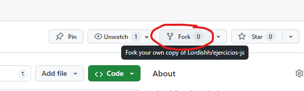
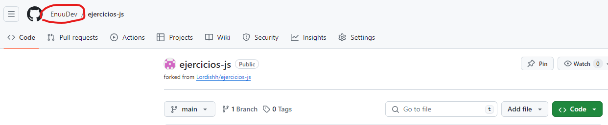
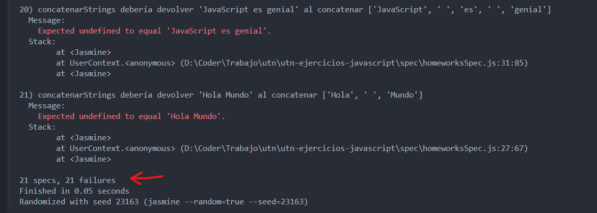

# `Ejercicios de práctica (validaciones)`

### Estos ejercicios de validaciones tienen como objetivo poner en práctica todos los conocimientos adquiridos en las clases.

## Para poder trabajar con este repositorio se requiere seguir una serie de pasos.

### Copiar el repositorio a tu cuenta de GitHub:

Para comenzar, vamos a copiar el repo a nuestra cuenta de GitHub. Para lograrlo, necesitamos dirigirnos al repositorio a copiar, en nuestro caso:

<https://github.com/Lordishh/ejercicios-validaciones-js>

Estando en el enlace mencionado, haremos clic en "fork" situado en la parte superior derecha.



Una vez confirmado, debería aparecer de la siguiente manera con tu nombre:



Ahora pueden continuar clonando el repositorio, lo que les permitirá empujar los cambios realizados a su cuenta de GitHub.

## Abrir los archivos `.md` en VSCode:

Para activar todas las funcionalidades como enlaces, imágenes y navegación en el archivo, pueden abrir los archivos `.md` con el visualizador previo. Para hacer esto, simplemente deben hacer "clic" secundario en el archivo y luego "abrir vista previa" o "Open Preview".

## Instalación de Dependencias
Para instalar las dependencias necesarias, asegúrate de tener Node.js y npm instalados en tu máquina. Luego, sigue estos pasos:

Dirígete al proyecto en el archivo raíz (donde se encuentra el `package.json`) y ahí ejecuta el siguiente comando:

```
npm install
```

## Ejecutar los test:
Una vez instaladas las dependencias, los tests deberían estar funcionando. Para eso, ejecuta el siguiente comando:

```
npx jasmine
```

Si todo funciona correctamente, debería verse algo como esto:



Eso indica que todos los test están fallando y eso está correcto, ya que estos deberán de ir dejando de fallar a medida que completen los ejercicios.

Intenta completar un ejercicio y vuelve a ejecutar.

## Como avanzar con los ejercicios:
Para realizar los ejercicios deben abrir el archivo `CONSIGNAS.md` con "vista previa" y cumplir con los objetivos. Cada ejercicio tiene una descripción y una orientación de que es lo que se espera resolver.

Las funciones a terminar de implementar se encuentran dentro de la carpeta `src`, el archivo `homeworks.js`.

¡¡¡Buen código a todos!!!

Ante cualquier duda, pueden preguntar en el apartado de consultas o bien contactarme directamente y estaré dispuesto en ayudarlos para trabajar con los ejercicios.
